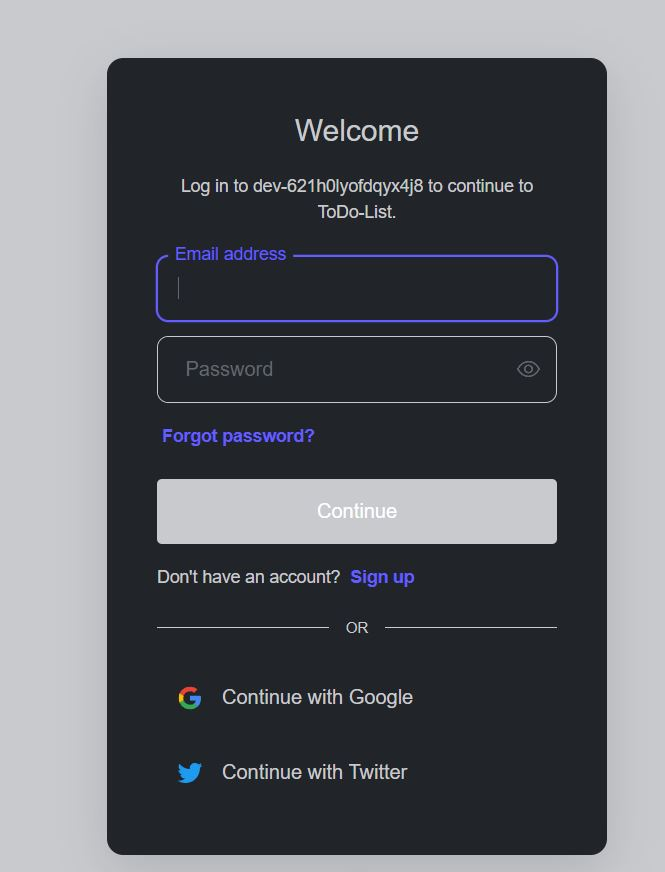
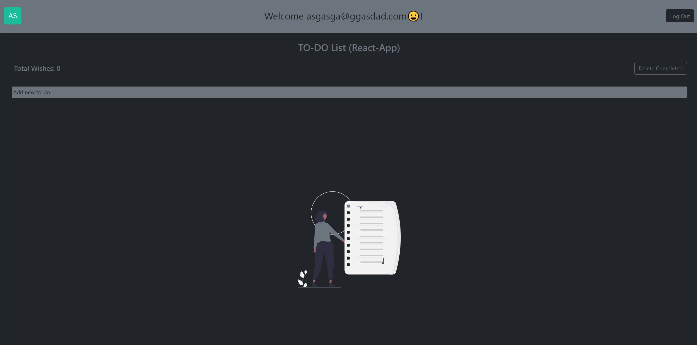
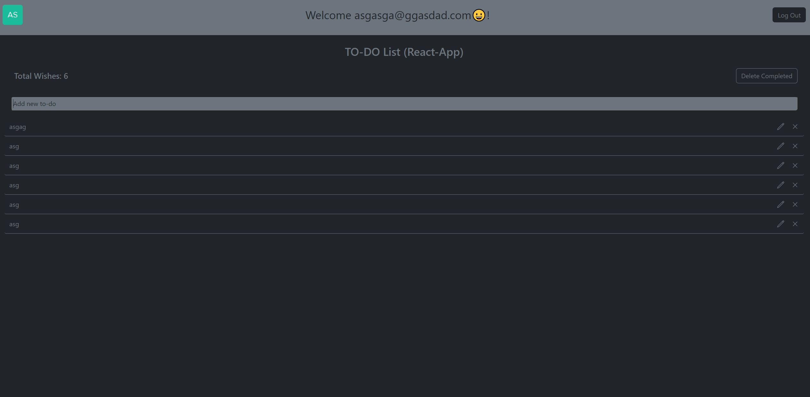
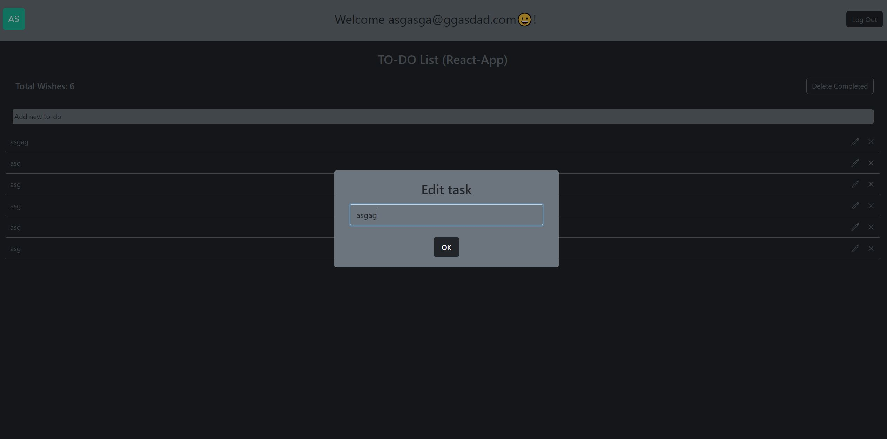
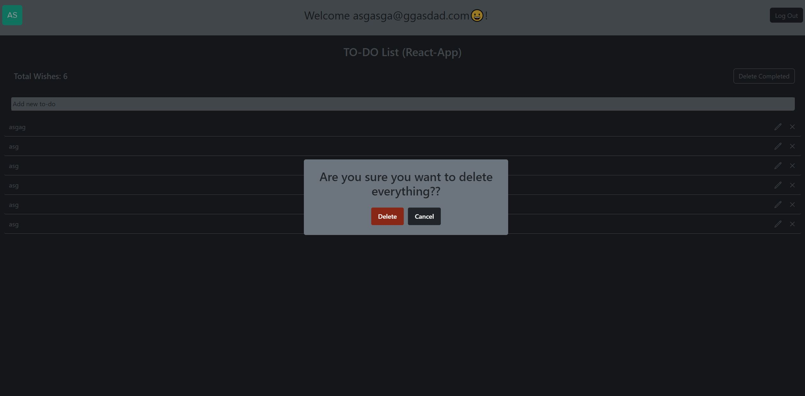

# { Frontend}

### MEDIA

---

---

---

---

### Clone the repository:

https://github.com/Psicowar/ToDo-List

## Install required dependencies:

npm install

## Run:
npm start

---
## Requierements:
To run the project you need to create a .env.development file
configuring:

PORT="For example 4000 or any free port you have"

MONGODB_URI="Your BD conecction"

### Project Description

To-Do App where the user can register, create, delete, edit and view tasks associated with their user account.

---
### Used Technologies
React:
https://es.react.dev/

Javascript:
https://developer.mozilla.org/es/docs/Web/JavaScript

Html:
https://developer.mozilla.org/es/docs/Web/HTML

Css:
https://developer.mozilla.org/es/docs/Web/CSS

Bootstrap:
https://getbootstrap.com/docs/5.3/getting-started/introduction/

---
### Used Libraries
Auth0:
https://auth0.com/

React-hook-form:
https://react-hook-form.com/

react-loader-spinner:
https://www.npmjs.com/package/react-loader-spinner

react-router-dom:
https://reactrouter.com/en/main

sweetalert2:
https://sweetalert2.github.io/

---

### Used IDE
https://code.visualstudio.com/

---
## Autors

<li>Dayan Álvarez Martínez</li>
    